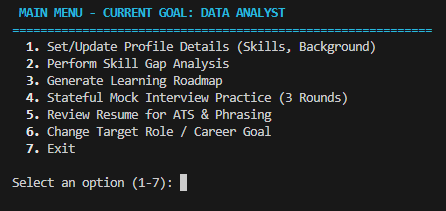

# AI Career Coach Agent

A production-ready, multi-agent AI Career Coach in Python. The system helps candidates plan their transition or advancement toward four high-demand technical roles: **Data Analyst**, **Data Scientist**, **AI Engineer**, and **Machine Learning Engineer**.

Using a modular multi-agent architecture and built-in security guardrails, the career coach guides users through profile building, skill gap analysis, customized learning roadmaps, resume feedback, and stateful mock interviews.

---
## Table of Contents

- Features
- Workflow
- Architecture Overview
- Technologies Used
- File Structure
- Getting Started
- Running the Application
- Running the Tests
- Example Output
- Future Improvements
- AI Agent Concepts Demonstrated
- License
---
## Features

- Multi-Agent AI architecture coordinated by a central Orchestrator.
- Secure prompt handling with PII redaction and prompt injection detection.
- Personalized Skill Gap Analysis for four AI career paths.
- AI-generated Learning Roadmaps with milestone-based plans.
- ATS-focused Resume Review with actionable recommendations.
- Stateful 3-round Mock Interview with AI feedback.
- Session persistence to continue previous progress.
- Export reports as Markdown files for future reference.
- Modular and extensible agent design.

## Workflow

1. User selects a target career path.
2. The Orchestrator routes every request.
3. The Security Agent validates and sanitizes the input.
4. The request is forwarded to the appropriate specialized agent.
5. The selected agent generates the response using Gemini.
6. Results are displayed in the CLI and optionally exported to Markdown.

## Architecture Overview

The application features a central orchestrator that coordinates specialized agents using the official Google GenAI SDK:

```
                  ┌────────────────────────┐
                  │       User CLI         │
                  └───────────┬────────────┘
                              │
                              ▼
                  ┌────────────────────────┐
                  │      Orchestrator      │
                  └───────────┬────────────┘
                              │
                              ▼
                  ┌────────────────────────┐
                  │     Security Agent     │
                  └─────┬────────────┬─────┘
                        │            │
            (If Safe)   │            │ (If Unsafe)
      ┌─────────────────┘            └─────────────────┐
      ▼                                                ▼
┌──────────────┬──────────────┬──────────────┬───┐   ┌──────────────────┐
│  Skill Gap   │   Roadmap    │  Interview   │...│   │  Block & Warn    │
│  Analysis    │  Generator   │ Preparation  │   │   │  Candidate       │
└──────────────┴──────────────┴──────────────┴───┘   └──────────────────┘
```
## Technologies Used

- Python 3.10+
- Google Gemini API
- Google GenAI SDK
- dotenv
- unittest
- Regular Expressions (Regex)
- Markdown
- Git & GitHub

### Specialized Agents:
1. **Security Agent**: Enforces data safety and guards against adversarial prompts.
   - **PII Redactor**: Employs fast, local Regex rules to strip emails and phone numbers *before* sending to the cloud, combined with LLM-assisted redaction to catch names and sensitive locations.
   - **Prompt Injection Detector**: Evaluates prompts to identify overrides, system bypass attempts, or jailbreaks, returning a structured safety verdict.
2. **Skill Gap Analysis Agent**: Evaluates user profiles against target role standards to provide a match score, highlights overlapping skills, and isolates critical technical, tool, and soft skill gaps.
3. **Learning Roadmap Agent**: Creates customized learning phases featuring core concepts, practical milestone projects, and curated learning references.
4. **Interview Preparation Agent**: Conducts dynamic, stateful mock interviews. It outputs challenging questions and evaluates candidates' responses with constructive critiques and ideal solutions.
5. **Resume Review Agent**: Assesses resume text to offer keyword optimization, format feedback, and STAR-formula rewrites.

---

## File Structure

```
career-coach-agent/
├── agents/
│   ├── __init__.py
│   ├── base_agent.py          # Abstract base agent class
│   ├── security_agent.py      # Regex + LLM-based security guardrails
│   ├── skill_gap_agent.py     # Skill alignment & gap analysis
│   ├── roadmap_agent.py       # Personalized study roadmap generator
│   ├── interview_agent.py     # Technical question generator and evaluator
│   └── resume_agent.py        # ATS-optimized resume feedback
│
├── core/
│   ├── __init__.py
│   ├── config.py              # Environment configuration & GenAI Client
│   └── orchestrator.py        # Sessions manager and routing orchestrator
│
├── ui/
│   ├── __init__.py
│   └── cli.py                 # ANSI-colored console interface
│
├── tests/
│   ├── __init__.py
│   └── test_agents.py         # Unit test suite
│
├── README.md
├── requirements.txt
└── main.py                    # App entrypoint
```

---

## Getting Started

### Prerequisites
- Python 3.10+
- A Google Gemini API Key

### Installation

1. Clone or copy the project files to your workspace directory.
2. Install the dependencies:
   ```bash
   pip install -r requirements.txt
   ```

### Configuration
Create a `.env` file in the root directory and add your Gemini API Key:
```env
GEMINI_API_KEY=your_actual_gemini_api_key_here
```
*(Alternatively, you can export `GEMINI_API_KEY` directly to your environment variables.)*

---

## Running the Application

Launch the interactive CLI dashboard:
```bash
python main.py
```
## Demo

The following screenshot shows the CLI interface of the AI Career Coach Agent.




### Navigating the App:
1. **Target Goal Selection**: On startup, choose your target role (e.g., AI Engineer).
2. **Set/Update Profile**: Input your educational background and current skills.
3. **Skill Gap Analysis**: Find out what you are missing.
4. **Custom Roadmap**: Generate a step-by-step roadmap to study and build projects.
5. **Stateful Mock Interview**: Practice in a 3-round interactive interview. Submit your answers and get immediate feedback.
6. **Resume Review**: Paste your resume text to optimize it for recruiters.

---

## Running the Tests

Unit tests are written using python's built-in `unittest` library and mock external API calls to run fully offline without consuming API tokens:

```bash
python -m unittest discover -s tests
```

## Example Output

```text
Target Role: Data Analyst

Skill Match Score: 72%

Missing Skills:
- SQL Window Functions
- Power BI
- Statistics

Recommended Learning Path:
Phase 1 → SQL Fundamentals
Phase 2 → Data Visualization
Phase 3 → Portfolio Projects
```

## Future Improvements

- Web interface using Streamlit.
- Support for additional career paths.
- Voice-enabled interview sessions.
- Persistent database storage.
- PDF resume parsing.
- Dashboard analytics for user progress.
---

## AI Agent Concepts Demonstrated

This project demonstrates multiple concepts covered in the Kaggle AI Agents course:

- Multi-Agent Architecture
- Central Orchestrator
- Security Guardrails
- Prompt Injection Detection
- PII Redaction
- Stateful Agent Workflow
- Google Gemini Integration
- Modular Agent Design

## License

This project is intended for educational purposes as part of the Kaggle AI Agents Intensive Vibe Coding Capstone Project.